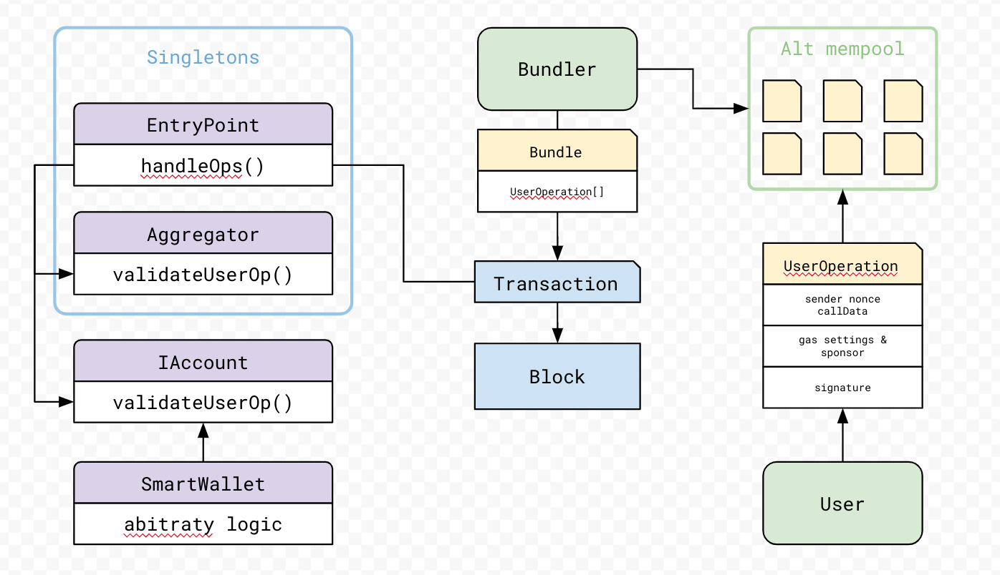

## Account Abstraction (ERC-4337)

Account abstraction is a way for accounts on ethereum to have arbitrary validation logic, by routing the verification to a smart contract function.
It also allows users to submit transactions without interacting directly with their wallets, which can greatly increase the UX of Ethereum.

### ERC-4338 Pipeline

This repository uses 

###

## Account Abstraction playground

In the project directory, you will find a collection of `contracts` implementing this standard and an
interactive dApp for education and testing purposes. The goal is the explore the possibilities which
includes:

* Having NFT owners able to validate transactions.
* Validating a transaction with a password.
* Sending a transaction through email, SMS or any means supported by a bundler.

The amount of features unlock this standard provides is obviously very big because only limited by
the logic you choose to code in your own smart wallet.

### `npm dev` or `npm start`

Runs the web app in the development mode.
Open [http://localhost:3000](http://localhost:3000) to view it in the browser.

### `npm run build`

Builds the web app for production to the `dist` folder.
It correctly bundles Solid in production mode and optimizes the build for the best performance.

### `npx hardhat test`

Executes unit tests for smart contracts.

### `npx hardhat run [scriptPath]`

Executes a script to use smart contracts, the provided [hardhat.config.js](./hardhat.config.js) supports Goerli, Sepolia and Mainnet.